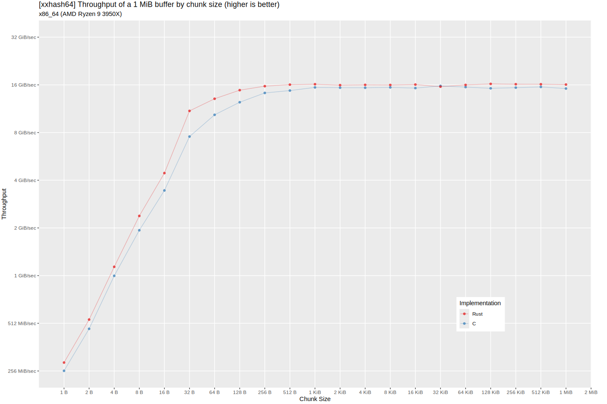
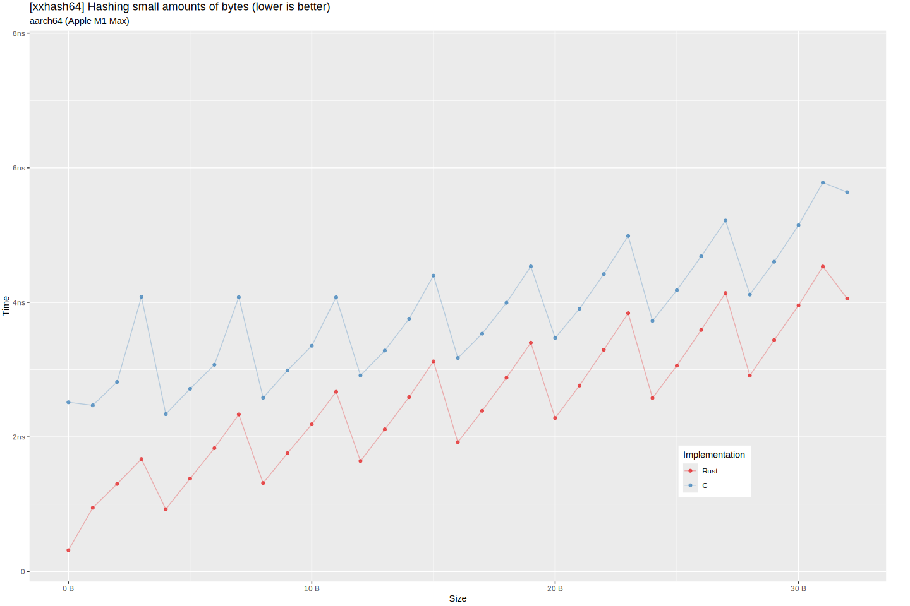
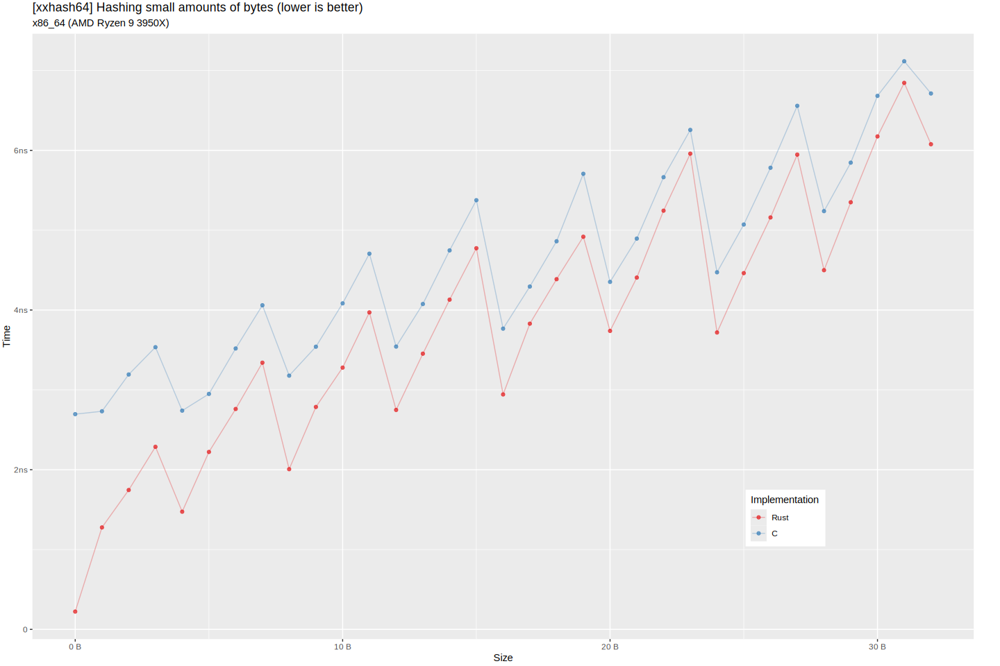
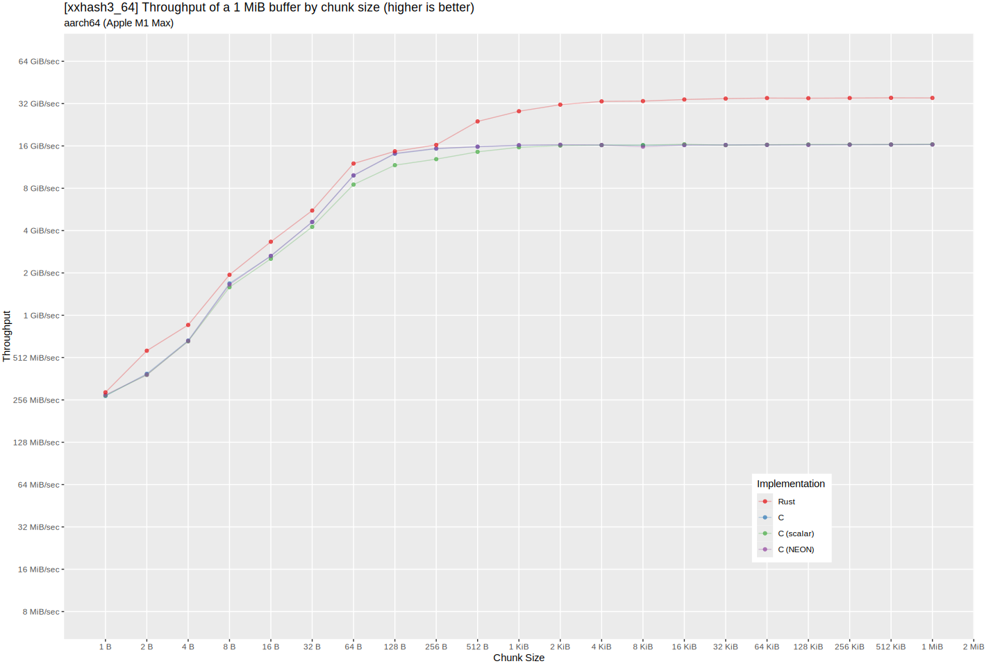
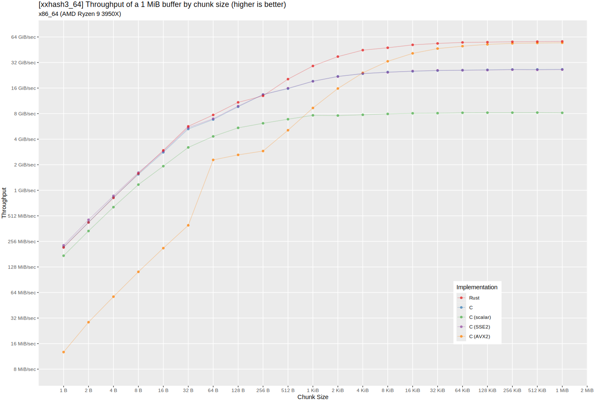
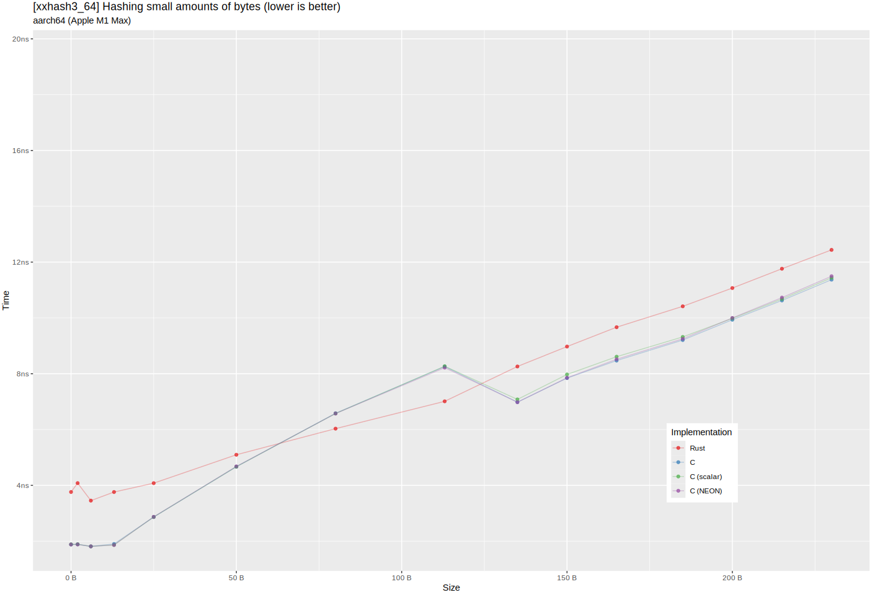
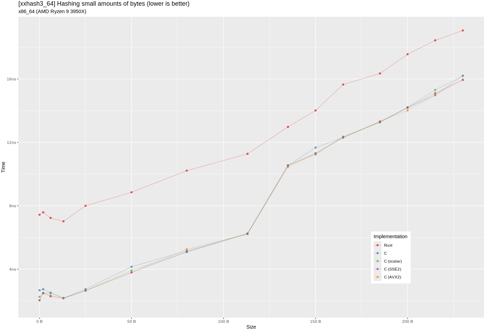

# Overview

Tests compare calling [the reference implementation in
C](https://xxhash.com) against equivalent functions in this crate. No
link-time optimization (LTO) is used, so the C performance numbers
have additional overhead for each function call.

Click any graph to see it full-size.

# xxHash64

## Oneshot hashing

Compares the **speed** of hashing an entire buffer of data in one
function call. Data sizes from 256 KiB to 4 MiB are tested. These
graphs are boring flat lines, so a table is used instead.

### aarch64

| Implementation | Throughput (GiB/s) |
|----------------|--------------------|
| Rust           | 13.5               |
| C              | 13.5               |

## x86_64

| Implementation | Throughput (GiB/s) |
|----------------|--------------------|
| Rust           | 16.5               |
| C              | 16.5               |

## Streaming data

Compares the **speed** of hashing a 1 MiB buffer of data split into
various chunk sizes.

### aarch64

### x86_64

## Small amounts of data

Compares the **time taken** to hash 0 to 32 bytes of data.

### aarch64

### x86_64

# xxHash3 (64-bit)

## Oneshot hashing

Compares the **speed** of hashing an entire buffer of data in one
function call. Data sizes from 256 KiB to 4 MiB are tested. These
graphs are boring flat lines, so a table is used instead.

### aarch64

| Implementation | Throughput (GiB/s) |
|----------------|--------------------|
| Rust           | 35.2               |
| C              | 35.0               |
| C (scalar)     | 21.2               |
| C (NEON)       | 35.1               |

### x86_64

| Implementation | Throughput (GiB/s) |
|----------------|--------------------|
| Rust           | 58.6               |
| C              | 25.0               |
| C (scalar)     | 7.5                |
| C (SSE2)       | 25.1               |
| C (AVX2)       | 57.8               |

## Streaming data

Compares the **speed** of hashing a 1 MiB buffer of data split into
various chunk sizes.

### aarch64

### x86_64

## Small amounts of data

Compares the **time taken** to hash 0 to 230 bytes of
data. Representative samples are taken from similar times to avoid
cluttering the graph and wasting benchmarking time.

### aarch64

### x86_64

# Benchmark machines

## Overview

| CPU               | Memory | C compiler         |
|-------------------|--------|--------------------|
| Apple M1 Max      | 64 GiB | clang 16.0.0       |
| AMD Ryzen 9 3950X | 32 GiB | cl.exe 19.41.34120 |

Tests were run with `rustc 1.81.0 (eeb90cda1 2024-09-04)`.

## Details

### aarch64

<table>
  <tr>
    <th>CPU</th>
    <td>Apple M1 Max</td>
  </tr>

  <tr>
    <th>Memory</th>
    <td>64 GiB</td>
  </tr>

  <tr>
    <th>C compiler</th>
    <td>Apple clang version 16.0.0 (clang-1600.0.26.3)</td>
  </tr>
</table>

### x86_64

<table>
  <tr>
    <th>CPU</th>
    <td>AMD Ryzen 9 3950X 16-Core Processor, 3501 Mhz, 16 Core(s), 32 Logical Processor(s)</td>
  </tr>

  <tr>
    <th>Memory</th>
    <td>32 GiB (3600 MT/s)</td>
  </tr>

  <tr>
    <th>C compiler</th>
    <td>Microsoft (R) C/C++ Optimizing Compiler Version 19.41.34120 for x86</td>
  </tr>
</table>
